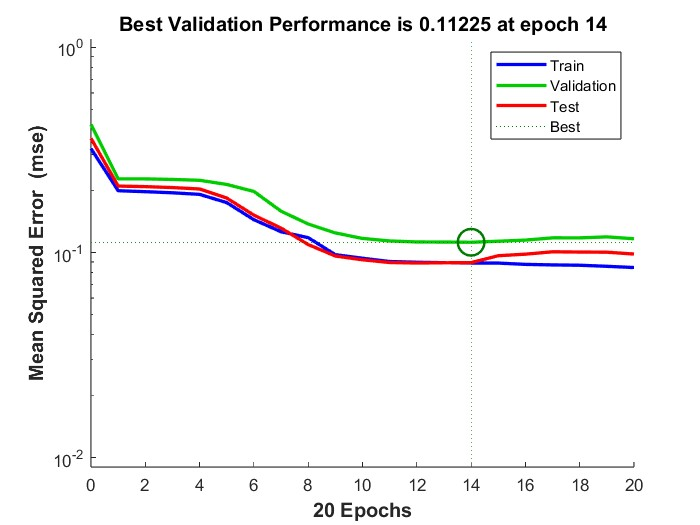

### Treinando MLP para reconhecimento de doenças de coluna

#### O script usa os dados de [column_3C](https://archive.ics.uci.edu/dataset/212/vertebral+column) para treinar uma MLP com uma hidden layer e uma camada de saída, para identificar 3 classes (normal, disk hernia e spondilolysthesis). A estratégia de validação utilizada foi a _hold-out_, e a acurácia final resulta da média aritimética de 10 resultados, com as amostras sendo permutadas em cada um deles.

